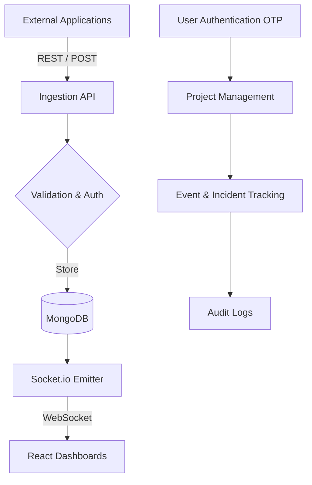

<h1 align="center">Apilogs 🚀</h1>

<p align="center">
  <strong>Real-Time Monitoring Platform | MERN Stack</strong>
</p>

<p align="center">
  A production-grade, multi-tenant monitoring platform that ingests structured events, manages incidents, and renders them efficiently through a performance-optimized React interface utilizing real-time WebSockets.
</p>

<p align="center">
  
  
  
  
  
  
</p>

---

## 📋 Table of Contents

- [Overview](#-overview)
- [Architecture](#%EF%B8%8F-architecture)
- [Features](#-features)
- [Tech Stack](#%EF%B8%8F-tech-stack)
- [Project Structure](#-project-structure)
- [Installation](#-installation)
- [Environment Variables](#-environment-variables)
- [API Documentation](#-api-documentation)
- [Security](#-security)
- [Performance & UX](#-performance--ux)
- [License](#-license)

---

## 🎯 Overview

Apilogs is a **project-based, real-time monitoring and incident management platform** designed to handle system events with enterprise-grade performance and security. It draws inspiration from modern SaaS observability tools, enabling teams to monitor, audit, and analyze system health in real time.

### Key Capabilities
- 🏗️ **Project-Based Architecture**: Organize monitoring around logical boundaries with dedicated projects.
- ⚡ **Real-Time Event Streaming**: Socket.io-based live event ingestion and instant UI updates.
- 🔐 **Advanced Authentication**: Secure login via OTP, powered by JWT and SendGrid/Nodemailer.
- 🚦 **Incident Management**: Track and manage critical system incidents.
- 📜 **Audit Logging**: Comprehensive audit trails for system actions.
- 🎨 **High-Performance UI**: Modern dashboard built with React 19, TailwindCSS, Framer Motion, and GSAP.

---

## 🏗️ Architecture

### System Overview

Event Sources → Ingestion API → Validation → MongoDB → WebSocket Broadcasting → React UI



---

## ✨ Features

- **Identity & Security**
  - Secure OTP-based authentication workflows.
  - JWT-based stateless sessions with bcrypt hashing.
  - Express Rate Limiting, Helmet, and XSS protection.

- **Project Management**
  - Create and manage monitoring projects.
  - Strict project-scoped data boundaries.

- **Event Ingestion & Processing**
  - RESTful event ingestion endpoints (`POST /ingest/:projectId`).
  - Structured data validation using Joi.
  - Automatic persistence and project association.

- **Incident & Audit Tracking**
  - Incident escalations and management flow.
  - Dedicated `AuditLog` for detailed security compliance tracking.

- **Real-Time & UI Experience**
  - Smooth micro-interactions powered by GSAP and Framer Motion.
  - Virtualized rendering for high-volume event feeds (`react-window`).

---

## 🛠️ Tech Stack

### **Frontend**
- **Core**: React 19, Vite 7, React Router DOM 7
- **Styling & Animations**: TailwindCSS v4, GSAP, Framer Motion
- **Data & Real-Time**: Axios, Socket.io-client, React Window

### **Backend**
- **Core**: Node.js, Express 5.x
- **Database**: MongoDB & Mongoose
- **Real-Time**: Socket.io
- **Security & Validation**: Joi, Bcrypt, JsonWebToken, Helmet, Express Rate Limit, XSS-Clean
- **Email Delivery**: @sendgrid/mail, Nodemailer

---

## 📂 Project Structure

```text
apilogs/
├── frontend/                 # React 19 / Vite Application
│   ├── src/
│   │   ├── api/              # Axios service calls
│   │   ├── assets/           # Static assets
│   │   ├── components/       # Shared UI components
│   │   ├── context/          # React context providers
│   │   ├── hooks/            # Custom React hooks
│   │   ├── pages/            # View components (Auth, Dashboard, Project, Event)
│   │   ├── routes/           # Application routing logic
│   │   └── utils/            # Helper functions
│   └── package.json
└── backend/                  # Node.js Express Server
    ├── src/
    │   ├── Database/         # MongoDB initialization
    │   ├── controllers/      # Route logic handlers
    │   ├── middleware/       # Auth, error, and security guards
    │   ├── models/           # Mongoose schemas (Event, Incident, Project, Users, etc.)
    │   ├── realtime/         # Socket.io event configurations
    │   ├── routes/           # Express router definitions
    │   ├── utils/            # Utilities (Email, Token generation)
    │   └── validations/      # Joi validation schemas
    └── package.json
```

---

## 🚀 Installation

**Prerequisites**
- Node.js 18+ or 20+
- MongoDB 6+
- npm or yarn

**Quick Start**
```bash
# Clone the repository
git clone https://github.com/yourusername/apilogs.git
cd apilogs

# Install backend dependencies
cd backend
npm install

# Install frontend dependencies
cd ../frontend
npm install
```

---

## 🔐 Environment Variables

You need to set up the appropriate `.env` files for both frontend and backend.

**Backend (`backend/.env`)**
```env
PORT=5000
MONGODB_URI=mongodb://localhost:27017/apilogs
JWT_SECRET=your_super_secret_key
SENDGRID_API_KEY=your_sendgrid_key
# or SMTP details for Nodemailer
```

**Frontend (`frontend/.env`)**
```env
VITE_API_URL=http://localhost:5000/api
VITE_SOCKET_URL=http://localhost:5000
```

---

## 🏃‍♂️ Running the Application

Open two separate terminals:

**Terminal 1 - Backend Server**
```bash
cd backend
npm start
# Server runs on http://localhost:5000
```

**Terminal 2 - Frontend Client**
```bash
cd frontend
npm run dev
# Client runs on http://localhost:5173 (default Vite port)
```

---

## 📚 API Documentation

### **Authentication**
- `POST /api/auth/register` - Create user account
- `POST /api/auth/login` - Initiate login workflow (Email/Password or OTP)
- `POST /api/auth/verify-otp` - Verify OTP tokens

### **Projects**
- `POST /api/projects` - Create a monitoring project
- `GET /api/projects` - List user projects
- `GET /api/projects/:id` - Get specific project details

### **Events/Ingestion**
- `POST /api/ingest/:projectId` - Ingest a structured event for a specific project
- `GET /api/events/:projectId` - Fetch event history

### **Incidents**
- `POST /api/incidents` - Create new incident report
- `GET /api/incidents` - List and filter incidents

---

## 🛡️ Security

- **Authentication Strategy**: Stateless JWT tokens for scalability.
- **Password Hygiene**: Bcrypt hashing.
- **OTP Verification**: Email-based one-time passwords via SendGrid/Nodemailer for enhanced login integrity.
- **Middleware Protections**:
  - `helmet`: Secures Express apps by setting various HTTP headers.
  - `express-rate-limit`: Basic rate-limiting to defend against brute-force attacks.
  - `xss-clean` & `express-mongo-sanitize`: Defense against injection attacks.

---

## ⚡ Performance & UX

- **UI Rendering**: Leverages `react-window` for virtualizing massive event datasets, preventing DOM bloat.
- **Animations**: Silky smooth interactions created with `GSAP` and `framer-motion`.
- **Database Optimizations**: Mongoose schemas utilizing indexes on frequently queried fields (e.g., `projectId`, timestamps).

---

## 📄 License
This project is licensed under the MIT License – see the `LICENSE` file for details.

---

## 📞 Contact

**Project Maintainer:** Ritik
GitHub: ritik5504
LinkedIn: https://www.linkedin.com/in/ritik5504
Email: rajritik34@gmail.com
